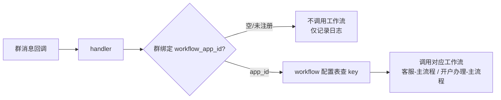

# qywx-kf-webhook

企业微信（WorkTool）客服消息回调服务。接收 WorkTool 推送的群聊/私聊消息，转发到 Dify 工作流做意图识别与客服问答，并维护群与公司的绑定关系、多轮对话记忆，以及把群聊天记录导出到 Dify 知识库。

## 技术栈

- Python 3.11
- FastAPI + uvicorn
- SQLite（本地存储）
- httpx + pydantic-settings
- Dify（工作流 / 知识库）

## 目录结构

```
src/
  main.py              # FastAPI 入口（/callback、/health、前端静态托管）
  config.py            # 配置加载（WT_* 前缀，按 APP_ENV 选 .env 文件）
  handler.py           # 消息处理器（Dify 工作流 + Echo 兜底，按群绑定取工作流）
  dify_client.py       # Dify 工作流客户端
  client.py            # WorkTool API 客户端（发送消息）
  binding.py           # 群绑定存储（群 ↔ 公司ID / 知识库 / 工作流）
  workflow_apps.py     # workflow 配置表存储（工作流应用 ID ↔ API Key）
  memory.py            # 对话记忆存储（chat_memory / session_stage）
  session_store.py     # 会话 ID 存储
  company.py           # 公司信息查询
  kb.py                # 知识库文档写入
  company_profile.py   # 群公司档案：客服手写公司描述 → 群知识库（构建/同步）
  exporter.py          # 知识库增量导出定时任务
  models.py            # 数据模型
  auth.py              # 管理接口鉴权（X-API-Key / Bearer token）
  api_auth.py          # 管理后台登录接口（用户名/密码 → token）
  api_bindings.py      # 群绑定管理接口
  api_workflows.py     # workflow 配置表接口（工作流应用注册）
  api_memory.py        # 对话记忆 / 会话阶段 / 知识库导出接口
  api_yuque.py         # 语雀外部知识库检索接口（Dify 外部知识库胶水服务）
  init_bindings.py     # 从 CSV 初始化群绑定
  init_kb_bindings.py  # 回填群知识库 dataset id
  init_datasets.py     # 批量创建群专属知识库
  sync_kb_ids_to_csv.py# 把知识库/工作流 ID 回填到 CSV
  sync_company_profiles.py  # 群公司档案：生成客服模板 / 同步到群知识库 / 清理
  update_kb_settings.py     # 批量更新现有知识库：换 Embedding 模型 / 开自动摘要
dify/                 # Dify 工作流 YAML（客服-主流程 / 开户办理-主流程 / 子工作流-QA问答 / 子工作流-WORKTOOL_OP）
docs/                 # 文档、客户群 CSV、执行文档
data/                 # SQLite 数据库（gitignore）
logs/                 # 运行日志（gitignore）
frontend/             # 管理后台前端（Vite + React + Tailwind，npm run build 后由后端托管）
```

## 快速开始

### 1. 安装依赖

```bash
cd qywx-kf-webhook
python3.11 -m venv .venv
source .venv/bin/activate
pip install -r requirements.txt
```

### 2. 配置环境

环境配置按 `APP_ENV` 环境变量选择对应的 `.env.{APP_ENV}` 文件（默认 `dev`，指定文件不存在时回退 `.env`）：

| 文件 | 用途 |
|------|------|
| `.env.dev` | 开发环境配置 |
| `.env.prod` | 生产环境配置 |

```bash
cp .env.dev .env.prod   # 复制一份并填入生产环境的值
```

### 3. 初始化数据库

首次运行前，从客户群 CSV 初始化群绑定关系：

```bash
python -m src.init_bindings docs/客户群列表_去重_公司ID回填.csv
```

### 4. 启动服务

**开发环境**

```bash
python -m src.main
```

**生产环境**

```bash
APP_ENV=prod python -m src.main
```

**后台常驻运行（生产）**

```bash
APP_ENV=prod nohup .venv/bin/python -m src.main > logs/prod.log 2>&1 &
```

**健康检查**

```bash
curl http://localhost:8000/health
# {"status":"ok"}
```

## 管理后台（前端）

`frontend/` 是管理后台前端（Vite + React 19 + TypeScript + Tailwind v4），用于：
- **群绑定关系管理**：查询 / 搜索 / 新增 / 编辑 / 删除群绑定（`group_bindings` 表）；新增或编辑时**知识库ID留空**，保存成功后自动调用 Dify API 创建该群专属知识库（命名 `群记忆_{group_id}`）并回填绑定，创建失败会在弹窗中提示（不影响绑定本身）；
- **会话服务阶段管理**：查询 / 搜索 / 设置 `session_stage` 表（stage 0~4，也可直接编辑）；
- **登录**：用户名/密码（`WT_ADMIN_USERNAME` / `WT_ADMIN_PASSWORD`）登录后签发 Bearer token 访问接口。

**开发模式**（前端热更新，`/api` 代理到本服务 8000 端口）：

```bash
cd frontend
npm install          # 首次
npm run dev          # 打开 http://localhost:8001（若端口被占会自动换端口）
```

**生产模式**（构建后由 Python 服务直接托管，访问 `http://<host>:8000/`）：

```bash
cd frontend
npm install
npm run build        # 生成 frontend/dist
cd ..
python -m src.main   # 或 APP_ENV=prod python -m src.main
```

> 注意：登录依赖 `.env` 中的 `WT_ADMIN_API_KEY`（后端 fail-closed）与 `WT_ADMIN_PASSWORD`（未配置时登录接口禁用）。
> 开发默认账号：`admin / admin123`（见 `.env.dev`），生产环境请修改 `.env.prod`。

## 配置项

所有配置以 `WT_` 为前缀，写在 `.env.dev` / `.env.prod` 中：

| 环境变量 | 说明 | 默认值 |
|----------|------|--------|
| `WT_HOST` | 监听地址 | `0.0.0.0` |
| `WT_PORT` | 监听端口 | `8000` |
| `WT_API_BASE_URL` | WorkTool API 地址 | `https://api.worktool.ymdyes.cn` |
| `WT_ADMIN_API_KEY` | 管理接口密钥（`/api/*` 请求头 `X-API-Key`，未配置时管理接口禁用） | — |
| `WT_ADMIN_USERNAME` | 管理后台登录用户名（配合 `WT_ADMIN_PASSWORD` 走 `/api/auth/login` 签发 token） | `admin` |
| `WT_ADMIN_PASSWORD` | 管理后台登录密码（未配置时登录接口禁用，仍可用 `X-API-Key`） | — |
| `WT_HTTPX_TRUST_ENV` | 调用 Dify/WorkTool 时是否走系统代理（httpx trust_env）：`false`=忽略代理直连（生产内网推荐）；开发机被 TUN 代理（如 Clash）接管导致连不上局域网 Dify 时设 `true` 走系统代理 | `false` |
| `WT_DEBOUNCE_SECONDS` | 回调防抖窗口（秒）：同一会话窗口内多条消息合并为一次工作流调用，全部消息仍入库 | `1.0` |
| `WT_DIFY_BASE_URL` | Dify 服务地址 | — |
| `WT_DIFY_TIMEOUT` | 工作流调用超时（秒） | `30` |
| `WT_DIFY_DB_PATH` | SQLite 存储路径 | `./data/app.db` |
| `WT_COMPANY_API_BASE_URL` | 公司数据网关地址 | — |
| `WT_COMPANY_API_KEY` | 公司数据网关密钥 | — |
| `WT_DIFY_DATASET_KEY` | 知识库（数据集）权限 Key | — |
| `WT_DIFY_EXPORT_TIME` | 知识库每日同步时间（北京时间 HH:MM，如 23:30 使文档名日期=当天聊天日期），空串=关闭定时同步（仅手动） | `23:30` |
| `WT_DIFY_DATASET_INDEXING` | 知识库索引方式：`economy`（关键词）/ `high_quality`（向量，需 Embedding 模型） | `economy` |
| `WT_COMPANY_PROFILE_DIR` | 群公司档案目录（客服手写的 `{群ID}.md` 描述文件，相对项目根目录或绝对路径） | `docs/公司档案` |
| `WT_YUQUE_TOKEN` | 语雀团队令牌（[获取地址](https://www.yuque.com/settings/tokens)），语雀外部知识库检索用 | — |
| `WT_YUQUE_EXTERNAL_KEY` | Dify「连接外部知识库」时填写的 API Key，本服务 `/retrieval` 鉴权用 | — |
| `WT_YUQUE_API_BASE` | 语雀开放 API 基础地址（企业版改成 `https://{企业域名}.yuque.com/api/v2`） | `https://www.yuque.com/api/v2` |
| `WT_YUQUE_SCOPE` | 默认搜索范围，形如 `团队login/知识库slug`（如 `myteam/mywiki`）；留空=搜索全部可见内容 | — |
| `WT_YUQUE_KB_SCOPES` | 外部知识库 ID → 语雀搜索范围映射（JSON），如 `{"yuque-wiki": "myteam/mywiki"}`；未匹配回退 `WT_YUQUE_SCOPE` | `{}` |

> 环境选择变量 `APP_ENV` 不带 `WT_` 前缀，只用于决定加载哪个 `.env` 文件，不是业务配置项。

## API 接口

**管理接口鉴权**：所有 `/api/*` 管理接口（群绑定 / workflow 配置 / 对话记忆）都要求凭据，二选一：
- 请求头 `X-API-Key: <WT_ADMIN_API_KEY>`；
- 请求头 `Authorization: Bearer <token>`（`POST /api/auth/login` 用户名/密码登录签发，12 小时有效）。

**未配置 `WT_ADMIN_API_KEY` 时管理接口整体禁用（503，fail-closed）**。
豁免：`/callback`（WorkTool 回调）、`/health`、`/retrieval`（语雀外部知识库，自带 `WT_YUQUE_EXTERNAL_KEY` 鉴权）、`/api/auth/login`（登录本身）。

```bash
# 管理接口调用示例（X-API-Key）
curl -H "X-API-Key: <你的管理密钥>" http://localhost:8000/api/bindings

# 用户名/密码登录（返回 Bearer token）
curl -X POST http://localhost:8000/api/auth/login \
  -H "Content-Type: application/json" \
  -d '{"username":"admin","password":"<WT_ADMIN_PASSWORD>"}'
# {"code":0,"message":"ok","data":{"token":"eyJ...","username":"admin","expires_in":43200}}

# 用 token 访问管理接口
curl -H "Authorization: Bearer eyJ..." http://localhost:8000/api/bindings
```

| 方法 | 路径 | 说明 |
|------|------|------|
| POST | `/callback?robotId=xxx` | 接收 WorkTool 消息回调（豁免鉴权） |
| GET | `/health` | 健康检查（豁免鉴权） |
| POST | `/api/auth/login` | 用户名/密码登录，返回 Bearer token（12 小时有效） |
| GET | `/api/auth/me` | 校验 token 并返回当前登录用户名 |
| GET | `/api/bindings` | 列出全部群绑定 |
| GET | `/api/bindings/query` | 查询单个绑定（`platform`、`group_id`） |
| POST | `/api/bindings` | 新增/更新绑定；`memory_dataset_id` 留空时保存成功后自动调用 Dify 创建该群专属知识库（`群记忆_{group_id}`）并回填，失败时响应带 `warning` 提示 |
| DELETE | `/api/bindings` | 删除绑定（软删除） |
| GET | `/api/workflows` | 列出 workflow 配置表（工作流应用注册，含 app_id/name/api_key） |
| POST | `/api/workflows` | 新增/更新工作流应用注册（`app_id`、`name`、`api_key`） |
| DELETE | `/api/workflows` | 删除工作流应用注册（`app_id`） |
| POST | `/api/messages/record` | 记录对话记忆 |
| GET | `/api/messages/history` | 查询对话历史（`session_id`） |
| GET | `/api/messages/stage` | 查询单个会话的服务阶段（`session_id`） |
| POST | `/api/messages/stage` | 设置/重置会话服务阶段（`session_id` + `stage` 0~4） |
| GET | `/api/messages/stages` | 分页列出全部会话阶段（`session_id` 模糊搜索、`limit`/`offset`） |
| POST | `/api/messages/export` | 导出单个群对话到知识库（`session_id` + `since_id` 增量） |
| POST | `/api/messages/sync` | 手动全量同步所有绑定知识库的群（与每日定时同步同逻辑） |
| POST | `/retrieval` | 语雀外部知识库检索（Dify「连接外部知识库」适配端点） |

### 语雀外部知识库接入 Dify

1. 在 `.env` 配置 `WT_YUQUE_TOKEN`（语雀团队令牌，[获取地址](https://www.yuque.com/settings/tokens)）和 `WT_YUQUE_EXTERNAL_KEY`（自定义强密码）；如需限定搜索范围，配置 `WT_YUQUE_SCOPE` 或 `WT_YUQUE_KB_SCOPES`。
2. 重启服务后，进入 **Dify 后台 > 知识库 > 连接外部知识库**：
   - **API 端点**：填 `http://<本服务地址>:8000/retrieval`（新版本 Dify 会自动在填写的地址后追加 `/retrieval`，两者皆可）；
   - **API Key**：填 `WT_YUQUE_EXTERNAL_KEY` 的值；
   - **外部知识库 ID**：填一个自定义 ID（如 `yuque-wiki`），若配置了 `WT_YUQUE_KB_SCOPES` 映射，该 ID 会决定检索哪个语雀知识库。
3. 在应用内选择该外部知识库即可检索语雀文档（返回内容为 Markdown 正文）。

> 说明：语雀搜索不返回相关性分数，`score` 按排名估算（第 1 名 0.95，逐名递减 0.1），Dify 侧可据此做阈值过滤与排序；语雀 API 有频率限制，每次检索会按 `top_k` 并发拉取正文（每文档一次详情请求，搜索结果自带正文时不再请求）。

### 回调测试示例

```bash
curl -s -X POST "http://localhost:8000/callback?robotId=wtgxpt9udc4pb4hgj0rnn139gfwcc6ls" \
  -H "Content-Type: application/json" \
  -d '{
    "groupName": "测试二群",
    "atMe": "false",
    "spoken": "拉人进群",
    "textType": 1,
    "rawSpoken": "拉人进群",
    "receivedName": "杨佳军",
    "roomType": 1
  }'
```

## 按群绑定 Dify 工作流（客服-主流程 / 开户办理-主流程）

回调服务按 **群绑定表 `group_bindings.workflow_app_id`** 决定调用哪个 Dify 工作流应用：
**一个群只绑定一个 workflow appid**（存工作流应用 ID），API Key 存在 **workflow 配置表
`workflow_apps`**（按 app_id 查 key，多个群可共用同一工作流应用）。**配置文件不再放
工作流 API Key**；群未绑定或应用未注册时本次不调用工作流（不回复）。



- **workflow 配置表（`workflow_apps`）**：`app_id`（= 群绑定里的 workflow_app_id，Dify 应用 ID）、
  `name`（应用名备注，如 客服-主流程 / 开户办理-主流程）、`api_key`（该应用 API Key，
  形如 `app-xxx`，Dify 应用「API 访问」页生成）。
  配置：`POST /api/workflows {"app_id": "xxx", "name": "开户办理-主流程", "api_key": "app-xxxx"}`
- **群绑定表 `group_bindings.open_account_id`（开户 ID）**：该群企业的开户 ID，通过开户信息查询 API
  （如 Dify 中的 `getOpenAccountDetail(id)`）查开户进度/信息。handler 按群名取该值注入工作流
  `openAccountId` 输入 → Agent 调用「查询开户详情」工具时作为 `id` 传入（未配置时回复"开户ID未登记"）。
  配置：`POST /api/bindings` 的 `open_account_id` 字段、`BindingStore.update_open_account_id`、
  或 CSV「开户ID」列回填（`python -m src.init_bindings`，CSV 空值保留库内已有值）。
- **开户办理-主流程**（`dify/开户办理-主流程.yml`）：接收与客服-主流程一致的参数
  （spoken/receivedName/roomType/atMe/textType/recentContext/companyIds/datasetId 等，另含
  `currentStage` 会话服务阶段、`openAccountId` 开户 ID），
  门控 → 开户意图识别 → 多轮收集开户必填信息（企业名称/统一社会信用代码/法定代表人/
  经办人电话/开户类型）→ 信息齐全后通过 WorkTool API（type=218）发送开户材料文件，
  并内置回答开户流程/材料咨询；回复统一经 WorkTool 发送。
- 群绑定配置方式：① 客户群 CSV 的「工作流AppID」列（`python -m src.init_bindings` 回填，CSV 空值保留库内已有值）；
  ② `POST /api/bindings` 直接配置；③ 存量单群可调 `BindingStore.update_workflow_app`。

## 运维脚本

| 脚本 | 说明 | 用法 |
|------|------|------|
| `init_bindings.py` | 从 CSV 初始化群绑定（含「工作流AppID」列回填 workflow_app_id，CSV 空值保留库内已有值） | `python -m src.init_bindings [csv路径]` |
| `update_company_ids.py` | 仅同步公司ID列到库（不触碰群名/状态/知识库等其他列） | `python -m src.update_company_ids [csv路径]` |
| `init_kb_bindings.py` | 按已有 `群记忆_*` 知识库回填 dataset id | `python -m src.init_kb_bindings [csv路径]` |
| `init_datasets.py` | 批量创建群专属知识库 | `python -m src.init_datasets [--with-company]` |
| `sync_kb_ids_to_csv.py` | 把知识库/工作流 ID 回填到 CSV | `python -m src.sync_kb_ids_to_csv [csv路径]` |
| `sync_company_profiles.py` | 群公司档案：生成客服模板 / 同步到群知识库 / 清理残留 | `python -m src.sync_company_profiles [--init] [--force] [--dry-run] [--prune]` |
| `update_kb_settings.py` | 批量更新现有知识库：换 Embedding 模型 / 开自动摘要（含自定义摘要提示词） | `APP_ENV=prod python -m src.update_kb_settings --embedding-model <模型> --embedding-provider <供应商> --summary-model <LLM> --summary-provider <LLM供应商> --summary-prompt "<提示词>" --cookie "session=..."` |

生产环境执行脚本需带 `APP_ENV=prod`：

```bash
APP_ENV=prod python -m src.init_datasets --with-company
```

## 群公司档案（客服手写公司描述 → 群知识库）

每个群知识库除每日对话流水外，还会有一份固定文档 **`群档案_{群ID}`**，内容是**客服手写**的
该群对应公司信息描述（一个群可对应多家公司，一家一块）。客服写作要求见
[`docs/公司档案写作规范.md`](docs/公司档案写作规范.md)。

工作流：

```bash
# 1. 为已绑定公司ID且缺档案的群生成模板（docs/公司档案/{群ID}.md，公司名从群名预填）
python -m src.sync_company_profiles --init

# 2. 客服按写作规范填写各公司块（编辑 docs/公司档案/{群ID}.md）

# 3. 同步到群知识库：删同名旧文档后重建一份，幂等
python -m src.sync_company_profiles

# 可选：--force 重新生成并覆盖模板；--dry-run 只预览；--prune 清理"档案已删除"的残留文档
```

- 档案文本遵循向量索引设计：每公司块首句为完整自然语言句、块间空行分隔、头部一句话列全公司名；
- 群绑定变更（`POST /api/bindings`）时会自动尝试同步该群档案（缺档案/未绑定知识库则跳过）；
- 档案文件存在但被清空 = 从知识库移除该档案；文件被删除后需跑 `--prune` 清理残留文档。

## 更换知识库 Embedding 模型 / 开启自动摘要（批量）

Dify 知识库在**创建时**固化当时的 Embedding 模型，改系统默认模型不影响已有库。
批量更新已有知识库（群知识库 + 可加制度库）：

```bash
# 1. 预览将更新的知识库（不实际调用）
APP_ENV=prod python -m src.update_kb_settings --dry-run \
  --embedding-model <新模型名> --embedding-provider <新供应商> \
  --summary-model <摘要LLM模型名> --summary-provider <LLM供应商> \
  --summary-prompt "用中文描述这段内容解决的问题，要求简洁、一两句话概括，不要使用编号列表或要点，不要输出思考过程、推理内容或 think 标签。" \
  --cookie "session=..."

# 2. 正式执行：逐库 PATCH 换模型（触发后台重嵌入）+ 开摘要 + 等重嵌入完成后触发摘要生成
APP_ENV=prod python -m src.update_kb_settings \
  --embedding-model <新模型名> --embedding-provider <新供应商> \
  --summary-model <摘要LLM模型名> --summary-provider <LLM供应商> \
  --summary-prompt "用中文描述这段内容解决的问题，要求简洁、一两句话概括，不要使用编号列表或要点，不要输出思考过程、推理内容或 think 标签。" \
  --cookie "session=..."
```

说明：
- **认证**：控制台 API 需登录会话，`--cookie`（浏览器 F12 复制 `session=...`）或 `--email/--password`（脚本自动登录）二选一；
- `--dataset-ids` 可追加不在群绑定表里的知识库（如制度库）；`--only-embedding` / `--only-summary` 可只做其中一项；
- 改 Embedding 模型会触发 Dify 后台**自动重新嵌入**该库全部文档（异步、无进度条，量大需等待）；
- 摘要设置只对新文档生效，脚本会在重嵌入完成后自动调用 generate-summary 给**已有文档**补生成摘要（每段生成，耗时长）；
- 重嵌入/摘要生成期间检索可能不稳定，属正常现象。

## 日志

- 应用日志写入 `logs/app.log`（2MB 轮转，保留 5 份）
- uvicorn 访问日志走 stdout，后台运行时建议重定向到 `logs/prod.log`

## 注意事项

- HTTP 客户端均设置 `trust_env=False` 直连内部服务，忽略本机代理环境变量，避免 socks 代理导致 `socksio` 缺失报错。
- `data/`、`logs/`、`.env.*` 均已被 gitignore，不提交密钥与本地数据。
- 知识库使用 `high_quality` 索引前，需在 Dify 控制台配置并设为默认的 Embedding 模型。
