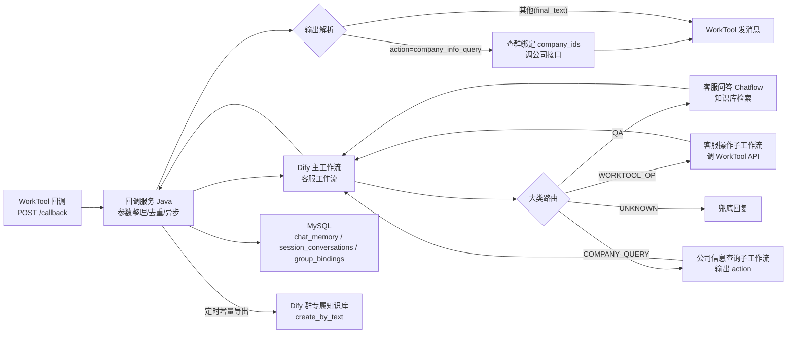

# 企业客服群接入 Dify 执行文档（Java + MySQL）

> 版本：v2.0（按当前落地实现整理，技术栈：Java 17 + Spring Boot 3 + MySQL 8 + Dify）
> 适用读者：需要按本架构独立实现「WorkTool 回调服务 → Dify 工作流」的研发同学。

## 1. 目标与范围

通过「回调服务（Java）」接收企业微信（WorkTool）群消息，整理参数后提交给 **Dify 主工作流**执行，覆盖三类能力：

| 大类 | 说明 | 执行方 |
|---|---|---|
| 客服问答（QA） | 咨询业务/产品/服务等通用问题 | Dify 客服问答 Chatflow（知识库检索） |
| WorkTool 操作 | 加好友 / 拉人进群 / 建群 | Dify 客服操作子工作流 → WorkTool API |
| 公司信息查询 | 员工信息/账单/财务/人事/社保公积金进度 | Dify 输出 action → 应用层用群绑定 company_id 调公司接口 |

核心设计原则：

- **意图识别用普通 LLM，不用 Chatflow**：多轮记忆已迁移到应用层（MySQL），Chatflow 的会话历史里存的是意图 JSON（非真实对话），既冗余又不适合做知识库。
- **记忆在应用层**：Dify 官方 API **不支持改写 Chatflow 历史会话**，因此真实对话（用户消息 + 机器人回复）由应用层持久化，并按需注入意图识别上下文。
- **回复发送**：问答/操作/追问的回复由主工作流内部调 WorkTool API 发送；公司查询结果由应用层发送。

## 2. 总体架构



调用链：

```
群消息 → 回调服务（3 秒内 ack，异步处理）
  → 读 MySQL：qaConversationId + 最近 6 轮对话(recentContext)
  → POST Dify 主工作流 /v1/workflows/run（blocking）
  → 主工作流：门控 LLM → 意图 LLM → 大类路由 → 调子应用 → 发回复
  → 回调服务解析输出：公司查询 action 由应用层执行；其余记录记忆
```

## 3. Dify 应用清单

| 应用 | 模式 | 作用 | 需要配置的 API Key |
|---|---|---|---|
| 客服工作流（入口） | workflow | 门控 + 意图识别 + 大类路由 + 调子应用 + 统一发消息 | DIFY_WORKFLOW_KEY |
| 客服问答 | advanced-chat | 知识库问答，qaConversationId 保持多轮 | DIFY_QA_APP_KEY |
| 客服操作工作流 | workflow | 加好友(213)/拉人(207)/建群(206) 指令构建与调用 | DIFY_WORKTOOL_APP_KEY |
| 公司信息查询工作流 | workflow | 输出 `action=company_info_query` + 参数 | DIFY_COMPANY_APP_KEY |
| 客服聊天记录 | ~~advanced-chat~~ | **已废弃**：意图分类改为主工作流内普通 LLM 节点，无需再部署 | — |

说明：客服问答 Chatflow 需按你自己的知识库（业务文档）创建；其余三个 workflow 的 DSL 已就绪，直接导入 Dify 并在「环境变量」里填各 Key 即可。

## 4. 数据库设计（MySQL 8）

### 4.1 群绑定表 `group_bindings`

```sql
CREATE TABLE group_bindings (
    id                BIGINT UNSIGNED AUTO_INCREMENT PRIMARY KEY,
    platform          VARCHAR(20)  NOT NULL DEFAULT 'wecom' COMMENT '群平台：wecom/feishu/dingtalk',
    group_id          VARCHAR(255) NOT NULL COMMENT '群ID（G 编码稳定标识，来自客户群列表初始化；WorkTool 回调无稳定群ID）',
    group_name        VARCHAR(255) NOT NULL DEFAULT '' COMMENT '群名称（回调只有群名，按此反查绑定）',
    company_ids       VARCHAR(512) NOT NULL DEFAULT '' COMMENT '公司ID列表，顿号分隔（兼容逗号/分号），如 1001、1002；避免与 CSV 列分隔符冲突',
    workflow_app_id   VARCHAR(64)  NOT NULL DEFAULT '' COMMENT '预留：Dify 客服 Workflow 应用ID',
    memory_dataset_id VARCHAR(64)  NOT NULL DEFAULT '' COMMENT '群专属 Dify 知识库ID（聊天记录导出目标）',
    status            TINYINT      NOT NULL DEFAULT 1 COMMENT '1启用 0停用',
    created_at        DATETIME     NOT NULL DEFAULT CURRENT_TIMESTAMP,
    updated_at        DATETIME     NOT NULL DEFAULT CURRENT_TIMESTAMP ON UPDATE CURRENT_TIMESTAMP,
    UNIQUE KEY uk_platform_group (platform, group_id),
    KEY idx_company (company_ids)
) ENGINE=InnoDB COMMENT='群与公司/知识库绑定关系';
```

### 4.2 会话 ID 表 `session_conversations`

```sql
CREATE TABLE session_conversations (
    session_id         VARCHAR(255) NOT NULL PRIMARY KEY COMMENT '会话标识，格式 roomType:chatId，如 1:测试二群',
    qa_conversation_id VARCHAR(64)  NOT NULL DEFAULT '' COMMENT '客服问答 Chatflow 会话ID（多轮上下文）',
    conversation_id    VARCHAR(64)  NOT NULL DEFAULT '' COMMENT '预留：意图 Chatflow 会话ID（已废弃）',
    updated_at         DATETIME     NOT NULL DEFAULT CURRENT_TIMESTAMP ON UPDATE CURRENT_TIMESTAMP
) ENGINE=InnoDB COMMENT='会话ID持久化';
```

### 4.3 对话记忆表 `chat_memory`

```sql
CREATE TABLE chat_memory (
    id           BIGINT UNSIGNED AUTO_INCREMENT PRIMARY KEY,
    session_id   VARCHAR(255) NOT NULL COMMENT '会话标识，同 session_conversations.session_id',
    sender_name  VARCHAR(255) NOT NULL DEFAULT '' COMMENT '说话人名称（receivedName）',
    user_message TEXT         NOT NULL COMMENT '用户消息',
    reply_text   TEXT         NOT NULL COMMENT '机器人最终回复',
    created_at   DATETIME     NOT NULL DEFAULT CURRENT_TIMESTAMP COMMENT '记录时间（UTC，展示时转北京时间）',
    KEY idx_session (session_id, id)
) ENGINE=InnoDB COMMENT='对话记忆（真实对话，知识库导出数据源）';
```

设计要点：

- 时间统一存 **UTC**（`CURRENT_TIMESTAMP`），展示/导出时转北京时间（UTC+8）。
- `chat_memory` 的 `id` 递增，知识库导出用 `id > since_id` 增量读取。
- 记忆裁剪：单会话最多保留最近 20 轮（超出删最旧），注入意图识别时取最近 6 轮。

## 5. 回调 → 主工作流参数契约

### 5.1 WorkTool 回调（3 秒内必须 ack，异步处理）

```
POST /callback?robotId={robotId}
{
  "spoken": "拉人进群", "rawSpoken": "拉人进群",
  "receivedName": "杨佳军", "groupName": "测试二群", "groupRemark": "",
  "roomType": 1, "atMe": "false", "textType": 1,
  "fileBase64": "", "messageId": ""
}
```

### 5.2 整理为主工作流 start 的 inputs

| 回调字段 | 工作流 input | 说明 |
|---|---|---|
| spoken | spoken | 消息文本 |
| rawSpoken | rawSpoken | 原始文本 |
| receivedName | receivedName | 发送者 |
| groupName | groupName | 群名 |
| groupRemark | groupRemark | 群备注 |
| roomType | roomType | 1外部群 2外部联系人 3内部群 4内部联系人 |
| atMe | atMe | 转布尔 |
| textType | textType | 1文本 2图片 等 |
| fileBase64 | fileBase64 | 截断 256 字符（当前链路不消费图片内容） |
| messageId | messageId | 去重用 |
| 会话表读出 | qaConversationId | 客服问答会话ID，首次为空 |
| chat_memory 最近 6 轮 | recentContext | 格式：`【历史对话】\n用户: …\n机器人: …`，上限 1500 字符 |

### 5.3 主工作流输出（结束节点）

| 分支 | 输出字段 |
|---|---|
| 常规（问答/操作/追问） | `final_text`（已发送的回复文本）、`qaConversationId` |
| 公司信息查询 | `action=company_info_query`、`query_type`、`keyword`、`period`、`params` |
| 门控跳过 | `result_`（场景描述，无需处理） |

## 6. 主工作流内部流程（Dify）

```
start → 校验&预处理(code) → 不支持的媒体类型? → 兜底
   → 门控判断?（群聊+未@ 才需要）
        ├─ 门控 LLM（YES/NO）→ 归一化 → 拒绝 → 结束（不发消息）
        └─ 通过/私聊/被@ → 意图 LLM → 解析JSON(去思考标签) → 大类路由
             ├─ QA            → 调 客服问答 Chatflow（chat-messages）→ 取 answer
             ├─ WORKTOOL_OP   → 调 客服操作子工作流（workflows/run）→ 取 reply_text
             ├─ COMPANY_QUERY → 调 公司信息查询子工作流（workflows/run）→ 解析
             │     └─ action 非空 → 结束（输出 action，不发消息）
             │     └─ 追问文本   → 汇入回复
             └─ UNKNOWN       → 兜底回复
   → 汇总回复（取第一个非空）→ 构建 type=203 消息 → WorkTool API 发送 → 结束
```

- **意图 LLM**：普通 LLM 节点（非 Chatflow），system prompt 含意图清单/实体规则/QA与公司查询严格区分/多轮补全规则；user prompt = `recentContext + 【当前消息】`。
- **多轮补全**：上一轮"拉张三进群"机器人追问"哪个群"，本轮"产品群"时，LLM 结合 recentContext 中的历史实体（张三）补全 `target_group=产品群`。
- **门控**：群聊且未被@时，门控 LLM 判定是否公开回复（建群/拉人/加好友/查询公司/客服提问 → YES）。

## 7. 子工作流契约

### 7.1 客服操作工作流（客服操作）

输入：`spoken`、`receivedName`、`is_group`、`chat_id`、`intent`（ADD_FRIEND/ADD_MEMBER/CREATE_GROUP）、`target_person`、`target_group`、`target_phone`。
行为：按 intent 构建 WorkTool 指令（213 加好友 / 207 拉人 / 206 建群）→ 调 `POST /wework/sendRawMessage?robotId={WT_ROBOT_ID}` → 校验 `code==0`。
输出：`reply_text`（追问或"指令已下发"确认文本）。

### 7.2 公司信息查询工作流（公司信息查询）

输入：`spoken`、`sender_name`（说话人姓名）、`query_type`、`keyword`、`period`。
行为：参数齐全 → 输出 `action=company_info_query` + `query_type/keyword/period/params`（params 含 sender_name，供应用层权限校验/审计）；参数缺失 → 输出带称呼的追问文本 `reply_text`（如"张三，请问您要查询哪类公司信息？"）。
**注意：该工作流只分类和抽参，不调公司接口**——公司接口地址/密钥/company_id 都在应用层，数据不经过 Dify。

## 8. 应用层（Java）职责

```
回调入口(3秒ack) → 消息去重(messageId) → 异步处理
  ├─ 读 MySQL：qaConversationId、最近6轮对话
  ├─ 调主工作流（DTO: WorkflowRunRequest）
  ├─ 持久化：qaConversationId、记忆(说话人+用户消息+回复+时间)
  └─ 解析输出：
       action=company_info_query
         → 查 group_bindings.company_ids
         → 未绑定：回复"该群未绑定公司信息"
         → 调公司接口 → 回复结果
       其他(final_text)
         → 工作流已自行发送，仅记录记忆，不重复回复
```

Java 关键接口骨架：

```java
public interface DifyClient {
    Map<String, Object> runWorkflow(Map<String, Object> inputs, String user);
    Map<String, Object> chatMessages(String appKey, String query, String conversationId, String user);
    Map<String, Object> createDatasetDocument(String datasetId, String name, String text);
}

public interface WorkToolClient {
    void sendText(String to, String content);               // type=203
    void sendRaw(Map<String, Object> item);                 // 指令
}

public interface CompanyInfoProvider {
    String query(List<String> companyIds, String queryType, String keyword, String period);
}
```

实现要点：

- **回调 ack**：`CompletableFuture.runAsync(...)` 异步处理，接口立刻返回 `{"code":0,"message":"参数接收成功"}`。
- **Dify 工作流响应**：`result` 在 Dify 新版本是对象、旧版本是 JSON 字符串，需兼容解析。
- **失败静默**：主工作流调用失败时只记录日志、不回复客户（blocking 调用超时并不代表工作流未执行，发兜底文案可能与工作流迟到的真实回复重复，故不再兜底回复）。

## 9. 接口清单

| 接口 | 方法 | 说明 |
|---|---|---|
| /callback | POST | WorkTool 消息回调（3 秒内 ack） |
| /health | GET | 健康检查 |
| /api/bindings | GET | 绑定列表 |
| /api/bindings/query?platform=&group_id= | GET | 查询单条绑定 |
| /api/bindings | POST | 创建/更新绑定 `{platform, group_id, group_name, company_ids, memory_dataset_id}` |
| /api/bindings | DELETE | 删除绑定（软删 status=0） |
| /api/messages/record | POST | 记录一轮对话 `{session_id, sender_name, user_message, reply_text}` |
| /api/messages/history?session_id=&limit= | GET | 对话历史（含北京时间 `time`） |
| /api/messages/export | POST | 增量导出知识库 `{session_id, since_id, limit}` → 返回 `last_id` |

## 10. 知识库记忆（导出与检索）

### 10.1 导出（定时任务/手动触发）

```
POST /api/messages/export {"session_id":"1:测试二群","since_id":0}
→ 读 chat_memory(id > since_id) → 格式化（每行带北京时间）→
  POST {DIFY_BASE_URL}/v1/datasets/{memory_dataset_id}/document/create_by_text
→ 返回 {exported: N, last_id: M}，下次把 last_id 作为 since_id 增量导出
```

文档文本示例：

```
杨佳军: 你们怎么收费（2026-08-14 11:32）
机器人: 我们的产品收费是xxx（2026-08-14 11:32）
李四: 那退款呢（2026-08-14 11:32）
机器人: 7天无理由退款（2026-08-14 11:32）
```

### 10.2 检索（可选，下一阶段）

QA 前调 `POST /v1/datasets/{dataset_id}/retrieve` 检索群知识库，命中片段并入 `recentContext`，让问答能"想起"历史对话。

## 11. 配置项

| 环境变量 / application.yml | 说明 |
|---|---|
| WT_API_BASE_URL | WorkTool API 地址 |
| WT_ROBOT_ID | 机器人 ID |
| DIFY_BASE_URL | Dify 服务地址 |
| DIFY_WORKFLOW_KEY | 主工作流「客服工作流」API Key（应用权限） |
| DIFY_QA_APP_KEY | 客服问答 Chatflow API Key（应用权限） |
| DIFY_WORKTOOL_APP_KEY | 客服操作工作流 API Key |
| DIFY_COMPANY_APP_KEY | 公司信息查询工作流 API Key |
| DIFY_DATASET_KEY | **数据集权限** Key（导出知识库用，应用 Key 无此权限） |
| DIFY_EXPORT_INTERVAL | 知识库增量导出定时任务间隔（秒），0=关闭；默认 300 |
| COMPANY_API_BASE_URL / COMPANY_API_KEY | 公司数据网关 |
| DB_URL / DB_USER / DB_PASSWORD | MySQL 连接 |

## 12. 实施步骤

1. **建表**：执行第 4 节 3 张表的 DDL。
2. **导入 Dify 应用**：导入「客服工作流 / 客服操作工作流 / 公司信息查询工作流」三个 DSL；创建「客服问答」Chatflow 并配置知识库。
3. **配置**：填第 11 节环境变量（各 API Key 在 Dify 应用「API 访问」页生成）。
4. **实现应用层**：按第 8 节职责实现回调、Dify 客户端、记忆、公司查询、知识库导出。
5. **绑定群**：用 `docs/客户群列表_去重.csv` 初始化群绑定（群ID=G编码、群名、公司ID、状态），或用 `POST /api/bindings` 单条维护；再为群配置 memory_dataset_id（知识库）。
6. **联调**：回调 → 主工作流 → 各子应用 → 回复；重点验证多轮补参数、公司查询、知识库导出三条链路。
7. **上线**：设置 `DIFY_EXPORT_INTERVAL` 后服务内置定时任务自动增量导出知识库（也可手动调 `POST /api/messages/export`）；监控 Dify 调用失败率。

## 13. 注意事项

1. **群无稳定 ID**：WorkTool 回调只有 groupName/groupRemark，先用客户群列表为每个群分配稳定 G 编码群ID（group_id），回调时按群名反查绑定；重名群（如默认名"群聊"）无法按名区分，需在企微侧重命名后重新导入（重名群初始化时 status=0 停用）。
2. **3 秒回调约束**：WorkTool 要求 3 秒内响应，必须 ack 后异步处理。
3. **意图不用 Chatflow**：Chatflow 历史存的是意图 JSON（噪音），且 Dify API 无法改写历史会话；意图识别用工作流内普通 LLM + 应用层记忆。
4. **回复不双发**：问答/操作/追问由主工作流发消息，应用层只处理 `action=company_info_query` 的回复，切勿对 final_text 重复发送。
5. **公司数据不出网**：company_ids、公司接口密钥都在应用层，Dify 只拿"查什么/查谁/查哪期"。
6. **多机器人**：当前回复由主工作流环境变量 WT_ROBOT_ID 发送；若多机器人按回调 robotId 区分，应改为应用层统一发送（工作流只返回文本）。
7. **时间**：库内存 UTC，展示/导出转北京时间。
8. **知识库 Key**：导出用"数据集"权限类型的 API Key，应用 Key 无数据集权限。

## 14. 已知限制与后续优化

- 图片消息暂不做视觉识别（意图链路以 "[图片]" 占位）。
- 知识库当前导原文，后续可加 LLM 总结后再入库（更精炼、去噪）。
- 会话记忆裁剪固定 20 轮，后续可按执行情况接入"轮换归档"策略（接近上限先总结入知识库再清记忆）。
- 知识库检索注入（§10.2）为下一阶段：QA 前调 `retrieve` 检索群知识库，命中片段并入 recentContext。

## 附录 A：本项目参考实现（Python 版）

本文档为面向 Java + MySQL 团队的实施规范；**本项目仓库（qywx-kf-webhook）按原技术栈 Python 3.11 + FastAPI + SQLite 已完整落地**，可作为参考实现对照：

| 文档章节 | 本项目实现（`src/`） |
|---|---|
| §5 回调参数契约 | `handler.py`（`DifyWorkflowHandler._build_inputs`） |
| §6 主工作流 | `dify/客服工作流.yml`（门控 LLM + 意图 LLM + 大类路由） |
| §7.1 操作子工作流 | `dify/客服操作工作流.yml` |
| §7.2 公司查询子工作流 | `dify/公司信息查询工作流.yml` |
| §8 应用层职责 | `handler.py` / `dify_client.py`（workflows/run）/ `company.py`（公司接口） |
| §9 接口清单 | `main.py`（/callback、/health）、`api_bindings.py`、`api_memory.py` |
| §10 知识库导出 | `kb.py`（create_by_text）+ `exporter.py`（定时增量导出）+ `memory.py`（since_id） |
| §11 配置项 | `config.py`（`WT_*` 前缀）+ `.env.dev` / `.env.prod`（由 `APP_ENV` 选择） |
| 记忆 | `memory.py`（chat_memory）、`session_store.py`（qaConversationId） |
| 群绑定 | `binding.py`（group_bindings，含 kb_last_export_id 导出游标） |

对应关系：**MySQL → SQLite**（`data/app.db`，表结构一一对应）、**Spring Boot → FastAPI**、**Mapper/JPA → sqlite3**。定时任务用内置 asyncio 循环（`exporter.kb_export_loop`）实现，对应 Java 侧的 `@Scheduled`。
